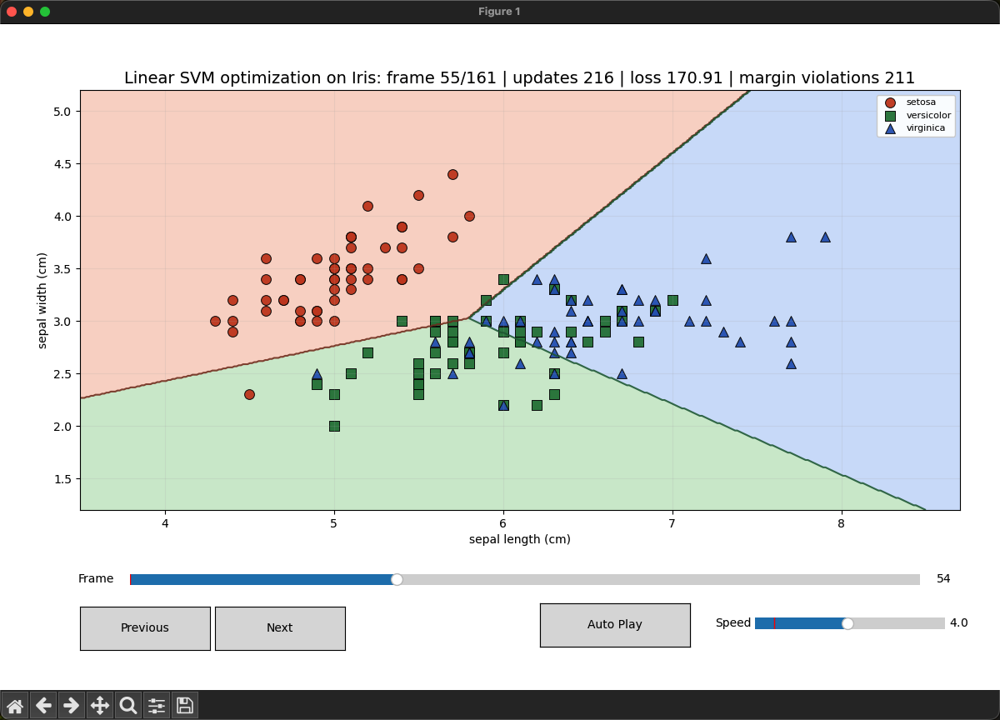
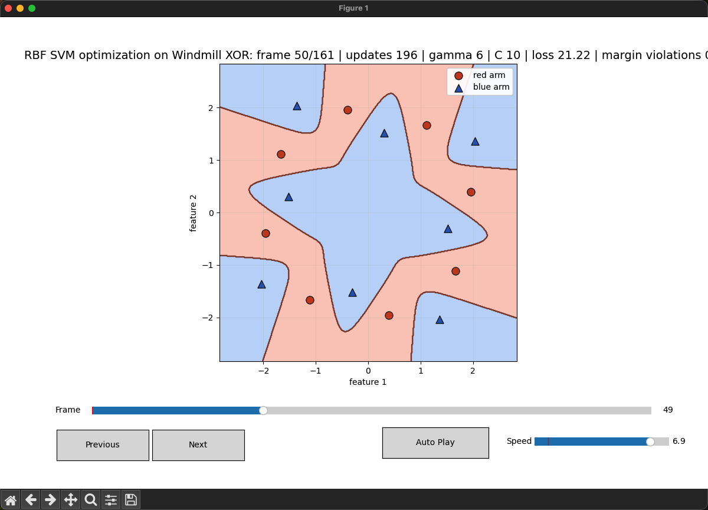
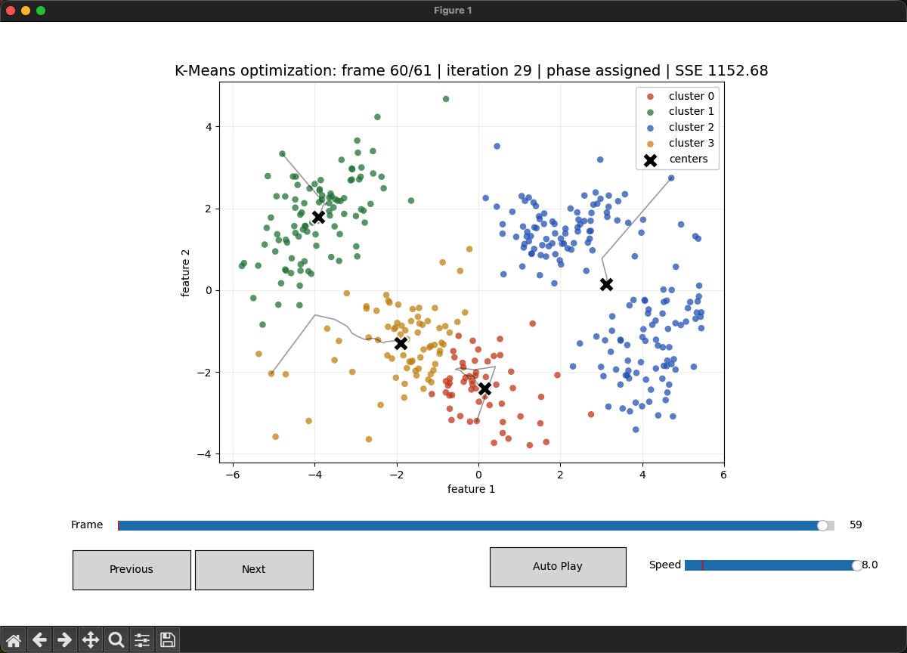
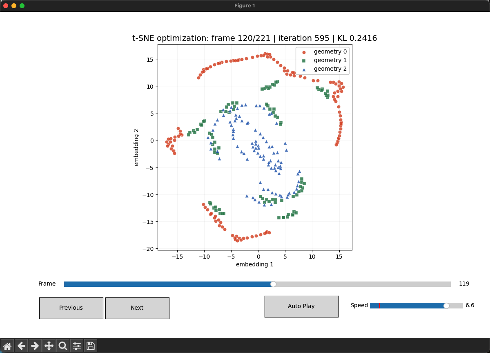
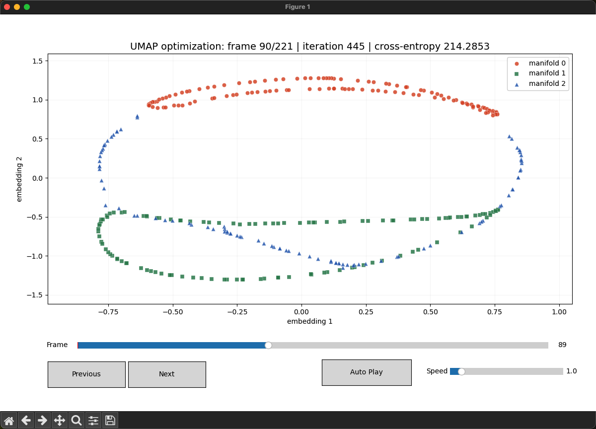
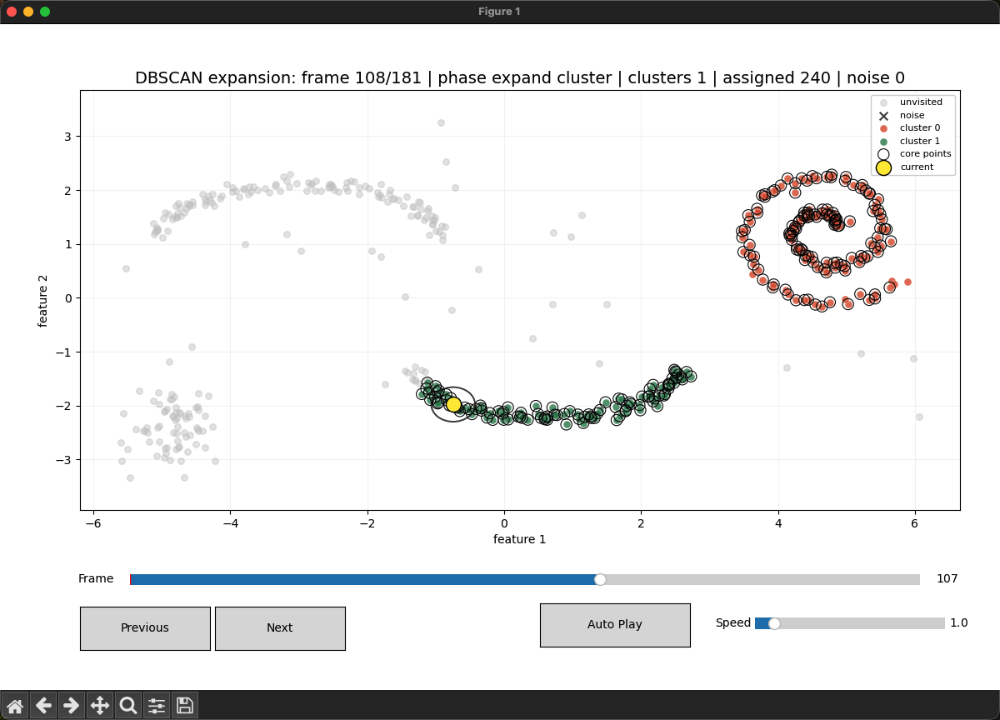
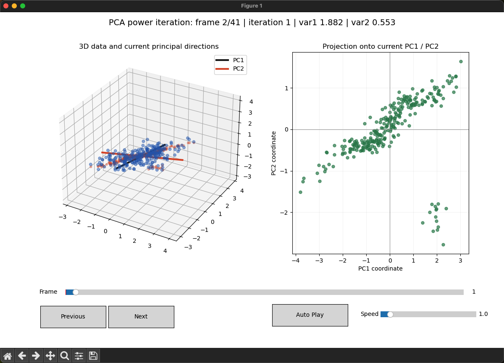
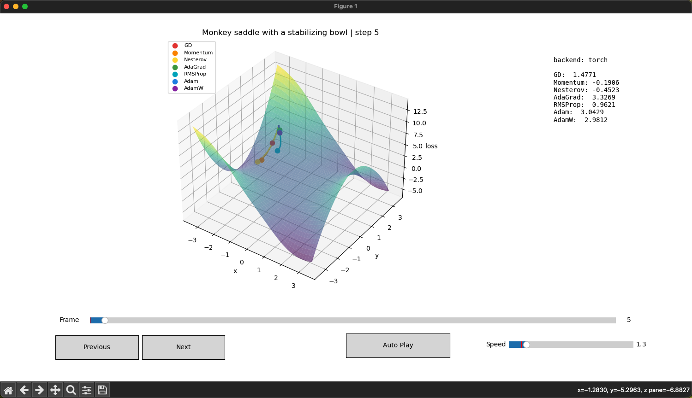

# Whitebox ML/DL Algorithms

这个仓库用于做“白盒算法过程演示”。重点不是调用库直接给最终结果，而是把算法内部每一步拆开，用动画展示参数、中心、嵌入坐标或决策边界如何逐渐变化。

## 当前包含的演示

### 1. 线性 SVM

目录：

```bash
svm_linear/
```



运行：

```bash
python3 svm_linear/svm_linear_iris_animation.py
```

特点：

- 使用 Iris 数据集前两个特征。
- 手写线性 SVM 的 hinge loss、L2 正则和梯度下降。
- 三分类使用 one-vs-rest。
- 每一帧展示 \(w,b\) 参数优化后的边界变化。

### 2. RBF SVM

目录：

```bash
svm_rbf/
```



运行：

```bash
python3 svm_rbf/main.py iris
python3 svm_rbf/main.py xor
```

特点：

- 不调用 `sklearn.svm.SVC`。
- 手写 RBF 特征映射：

\[
\phi_j(x)=\exp(-\gamma\lVert x-c_j\rVert^2)
\]

- 在 RBF 特征空间里手写 SVM 优化。
- 支持 Iris 三分类和 16 点风车 XOR。

### 3. K-Means

目录：

```bash
kmeans/
```



运行：

```bash
python3 kmeans/main.py
```

特点：

- 不调用 `sklearn.cluster.KMeans`。
- 自己生成复杂二维高斯混合数据。
- 手写 assignment step、update step 和 SSE。
- 每一帧展示点重新分配或中心移动。

### 4. t-SNE

目录：

```bash
tsne/
```



运行：

```bash
python3 tsne/main.py
```

特点：

- 不调用 `sklearn.manifold.TSNE`。
- 自己生成几何图案点云。
- 手写高维相似度 \(P\)、低维 t 分布相似度 \(Q\)、KL 散度和梯度下降。
- 每一帧展示低维嵌入被吸引和排斥不断拉扯的过程。

### 5. UMAP

目录：

```bash
umap/
```



运行：

```bash
python3 umap/main.py
```

特点：

- 不调用 `umap-learn`。
- 自己生成几何高维流形数据。
- 手写 k 近邻图、fuzzy graph 权重和低维吸引/排斥优化。
- 每一帧展示 embedding 如何在邻域保持和排斥力之间逐步展开。

### 6. DBSCAN

目录：

```bash
dbscan/
```



运行：

```bash
python3 dbscan/main.py
```

特点：

- 不调用 `sklearn.cluster.DBSCAN`。
- 自己生成月牙、螺旋、小岛和噪声组成的复杂密度点云。
- 手写 eps 邻域、核心点判定、噪声标记和密度可达扩展。
- 每一帧展示 DBSCAN 如何从核心点开始扩张簇。

### 7. PCA

目录：

```bash
pca/
```



运行：

```bash
python3 pca/main.py
```

特点：

- 不调用 `sklearn.decomposition.PCA`。
- 自己生成三维相关点云。
- 手写中心化、协方差矩阵、幂迭代和正交化。
- 每一帧展示主成分方向如何逐步旋转到最大方差方向。

### 8. 随机森林

目录：

```bash
random_forest/
```


运行：

```bash
python3 random_forest/main.py
```

特点：

- 不调用 `sklearn.ensemble.RandomForestClassifier`。
- 自己生成复杂二维分类数据。
- 手写 bootstrap、CART 节点分裂、Gini impurity 和森林投票。
- 每一帧展示新节点 split 和投票边界如何变化。

### 9. XGBoost 风格梯度提升树

目录：

```bash
xgboost/
```


运行：

```bash
python3 xgboost/main.py
```

特点：

- 不调用 `xgboost` 库。
- 自己生成复杂二维二分类数据。
- 手写 logloss 梯度/海森、二阶 CART、split gain 和叶子权重。
- 每一帧展示提升树如何逐步修正当前概率边界。

### 10. 线性回归

目录：

```bash
linear_regression/
```


运行：

```bash
python3 linear_regression/main.py
```

特点：

- 不调用 `sklearn.linear_model.LinearRegression`。
- 自己生成带噪声和离群点的一维回归数据。
- 手写 MSE、梯度和梯度下降。
- 每一帧展示拟合直线如何随着 \(w,b\) 优化而移动。

### 11. 优化器轨迹

目录：

```bash
optimizers/
```



运行：

```bash
python3 optimizers/main.py
```

特点：

- 对比 GD、Momentum、Nesterov、AdaGrad、RMSProp、Adam 和 AdamW。
- 如果 PyTorch 可用，就逐帧调用 PyTorch optimizer 的 `step()`。
- 如果 PyTorch 无法导入，就 fallback 到 NumPy 更新规则。
- 每一帧展示不同优化器的小球在同一个 3D loss surface 上如何移动。

## 设计原则

- 算法训练过程尽量手写，避免调用库隐藏核心步骤。
- 图形界面统一使用 Matplotlib。
- 动画都带 `Previous`、`Next`、`Auto Play`、`Speed` 和 `Frame` 控件。
- README 必须解释公式、过程和每一帧的含义。
- 数据尽量选择能暴露算法特点的可视化数据，而不是只追求最终分数。
