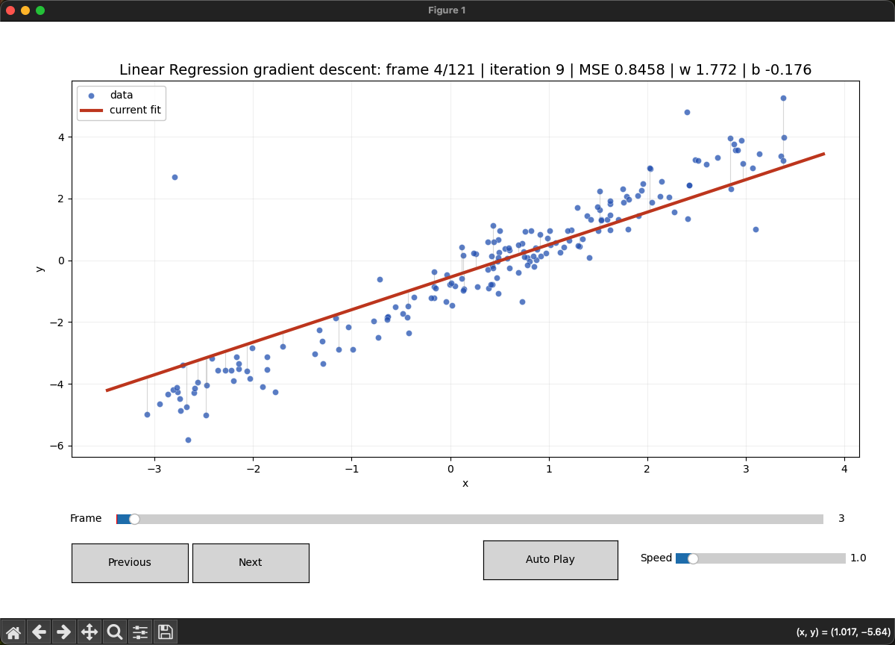

# 线性回归梯度下降动画

这个目录演示一元线性回归的优化过程，不调用 `sklearn.linear_model.LinearRegression`。



当前实现手写：

- 数据标准化。
- 线性模型。
- MSE 损失。
- 梯度计算。
- 梯度下降。

## 1. 运行方式

```bash
python3 linear_regression/main.py
```

## 2. 模型

一元线性回归模型：

\[
\hat{y}=wx+b
\]

## 3. 损失函数

使用均方误差：

\[
MSE=\frac{1}{n}\sum_i(\hat{y}_i-y_i)^2
\]

## 4. 梯度下降

参数更新：

\[
w \leftarrow w-\eta\frac{\partial MSE}{\partial w}
\]

\[
b \leftarrow b-\eta\frac{\partial MSE}{\partial b}
\]

动画里红线是当前拟合直线，灰色竖线表示部分样本的残差。每一帧会执行若干次梯度下降，标题显示当前 MSE、\(w\) 和 \(b\)。
