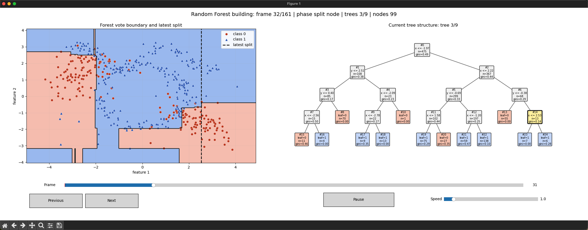

# Random Forest Construction Animation

English version. Chinese version: [README_CN.md](README_CN.md)



Run:

```bash
python3 random_forest/main.py
```

This demo does not call `sklearn.ensemble.RandomForestClassifier`. It implements bootstrap sampling, CART splits, Gini impurity, random feature subsets, and forest voting. The left panel shows the vote boundary; the right panel shows the current tree being built.
