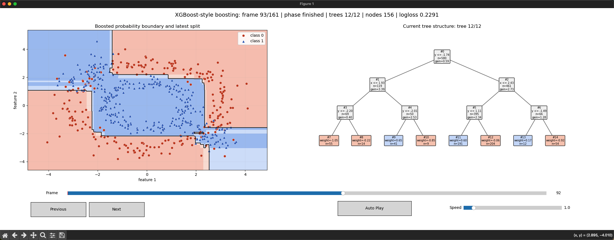

# XGBoost 风格梯度提升树动画

这个目录演示 XGBoost 风格的二分类梯度提升过程，不调用 `xgboost` 库。



当前实现手写：

- logloss 的梯度和海森。
- 二阶 CART 回归树。
- split gain。
- 叶子权重。
- learning rate shrinkage。
- 多棵树逐步累加到 logit。

## 1. 运行方式

```bash
python3 xgboost/main.py
```

## 2. 二分类 logloss

模型维护每个样本的 logit：

\[
\hat{y}_i = \sigma(F_i)
\]

logloss 是：

\[
L = -y_i\log(\hat{y}_i) - (1-y_i)\log(1-\hat{y}_i)
\]

一阶和二阶导数：

\[
g_i = \hat{y}_i - y_i
\]

\[
h_i = \hat{y}_i(1-\hat{y}_i)
\]

## 3. 叶子权重

一个叶子包含样本集合 \(I\)，令：

\[
G=\sum_{i\in I}g_i,\quad H=\sum_{i\in I}h_i
\]

叶子最优分数是：

\[
w^* = -\frac{G}{H+\lambda}
\]

## 4. Split gain

一次 split 的二阶增益是：

\[
Gain =
\frac{1}{2}
\left[
\frac{G_L^2}{H_L+\lambda}
+
\frac{G_R^2}{H_R+\lambda}
-
\frac{G^2}{H+\lambda}
\right]
-\gamma
\]

动画里每棵树都会按这个 gain 逐节点分裂。

## 5. 动画每帧表示什么

每一帧执行若干个节点 split：

1. 当前预测产生 \(g_i,h_i\)。
2. 构造一棵二阶回归树。
3. 每个叶子学习一个 logit 增量。
4. 树完成后，以 learning rate 缩放后加到全局 logit。
5. 背景概率边界更新。

左侧是当前 boosted probability boundary，右侧是当前正在构造的树。
